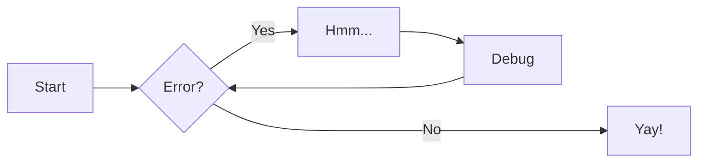

# Team 9964A Description

## Choices

We decided to use PROS and the supporting library, OkapiLib due to various reasons. While researching about important aspects of a robot, one key feature that was common in most high-level teams was the implementaion of Odometry. This is the practice where rotation encoders are utilized to calculate the actual movement of the robot. When researching how to implement Odometry, we came across PROS, specifically OkapiLib. We found that this was one of the easiest ways to implement odometry that could be customized for uses in many different scenarios. Another feature was the ease of implementation of a PID controller, something that is desperately needed to effectively calibrate our robot's aged motors. Another key feature that led to the decision was the reinstatement of certain C++ features that were removed in the implementation of VEXcode.

